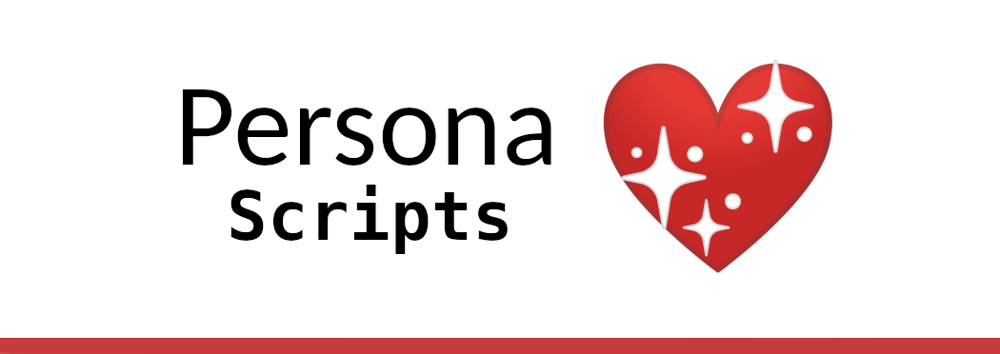

### _System is a free, elegant, and safe desktop framework that equips various kinds of computer users with exceptional software and curated resources._

Version: 0.0.1 *beta*, codename: [Antikythera](https://en.wikipedia.org/wiki/Antikythera_mechanism)

## Install

1. Install [Ubuntu](https://www.ubuntu.com/download/desktop) or [Xubuntu](https://xubuntu.org/) (preferred) (note: any Linux operating system with `snap` and `apt` is supported).
2. Execute the following command in the terminal:
```
sh -c "$(wget https://raw.githubusercontent.com/GoTeamEpsilon/System/master/install.sh -O -)"
```

_Note: During this install as well as subsequent Persona installs, you'll need to ensure you have an active internet connection and your computer doesn't go to sleep._

## Personas

#### General

This persona is installed automatically. It comes with Windows compatibility software, popular note taking applications, cloud-music players, day-to-day utilities, messengers, and Google Chrome. ([See all packages](https://github.com/GoTeamEpsilon/System/blob/master/personas/docs.md#general))

#### Gamer Persona

_Install:_ `cd ~/Desktop/System/personas/gamer && ./gamer.sh`

The gamer persona comes with popular console emulators, PlayOnLinux, Steam, well-known Linux games, and gamer-specific communication tools. ([See all packages](https://github.com/GoTeamEpsilon/System/blob/master/personas/docs.md#gamer))

#### Engineer Persona

_Install:_ `cd ~/Desktop/System/personas/engineer && ./engineer.sh`

The engineer persona is filled with editors, IDEs, scientific python, database tools, essential docker resources, cloud tools, compiliers, popular front-end framework generators, CAD packages, and much more. ([See all packages](https://github.com/GoTeamEpsilon/System/blob/master/personas/docs.md#engineer))


#### Creative Persona

_Install:_ `cd ~/Desktop/System/personas/creative && ./creative.sh`

This persona is packed with music production software, video editors, and graphics/art tools. ([See all packages](https://github.com/GoTeamEpsilon/System/blob/master/personas/docs.md#creative))


#### Clinician Persona

_Install:_ `cd ~/Desktop/System/personas/clinician && ./clinician.sh`

The clinician persona offers an advanced medical imaging viewer, native views of common clinicial references, and an install link to the popular OpenEMR Cloud Standard EHR. ([See all packages](https://github.com/GoTeamEpsilon/System/blob/master/personas/docs.md#clinician))


## Devs

[Team Epsilon](https://github.com/GoTeamEpsilon/purpose) is a volunteer team of like-minded developers who strive to positively contribute to open source through code, education, and kindness. [Join us](https://github.com/GoTeamEpsilon/purpose/issues/new). Support us on [Patreon](https://www.patreon.com/matthewvi).

## License

Public Domain (CC0)
