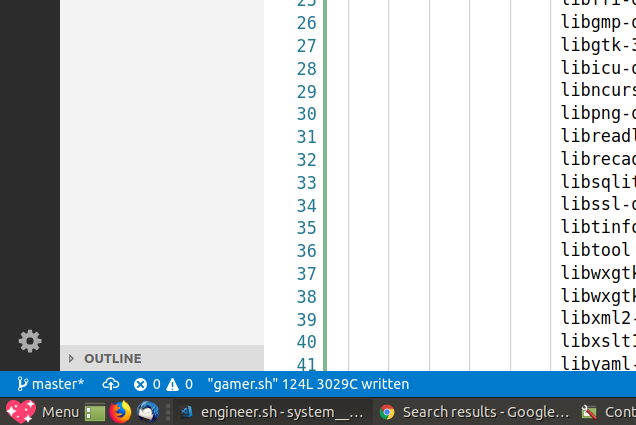

## _System is a free, elegant, and safe desktop designed for many types of computer users around the world._


The software is experimental and *VERY* unstable at this time. System versions will be released alphabetically with ancient-greek inspired names. The first version will be called ["Antikythera"](https://en.wikipedia.org/wiki/Antikythera_mechanism).

# User Personas

TODO: Matthew to work with designer on branding each persona and what tooling and resources entail. Current personas are:

- General*
- Gamer
- Engineer
- Clinician
- Creative

_*(prereq - must be installed for system or other personas to work - will be abstracted away from the users soon)_

_(ordered in terms of stability)_

# Technical

## Install

1. Download Ubuntu MATE 18.04.1 LTS (Bionic): https://ubuntu-mate.org/download/
2. Mount it on a USB stick for installation: https://tutorials.ubuntu.com/tutorial/tutorial-create-a-usb-stick-on-ubuntu#0.
3. Plug flashdrive in, restart computer, and ensure BIOS boot load order brings up the USB stick-Ubuntu for the install wizard process.
4. Walk through the setup wizard.
5. Once install, open up the MATE terminal and run:

```
cd ~/Desktop
git clone https://github.com/GoTeamEpsilon/system.git
cd system/src
./main.sh
```

6. Run the "general" persona installer to set up the operating system.

```
# cd ~/Desktop/system/src
cd persona_installers

./general.sh
```

7. Consider which personas you'd like to install and run the installers like so:

```
# cd ~/Desktop/system/src
cd persona_installers

./creative.sh

./clinician.sh

./engineer.sh

./gamer.sh
```

## Devs

[Team Epsilon](https://github.com/GoTeamEpsilon/purpose) is a volunteer team of like-minded developers who strive to positively contribute to open source through code, education, and kindness. [Join us](https://github.com/GoTeamEpsilon/purpose/issues/new).

_We don't have a Patreon yet, but you can donate to Matthew Vi here: https://www.patreon.com/matthewvi until we set up a bank account. Thanks!_

## TODOs

- Fix brokenness
- Get the "Start Heart" to be pre-configured (didn't note down the initial icon file loc for overriding):


- Set default wallpaper and screensaver to cosmos
- Set default panel to redmond
- Make menu launchers for software that doesn't have it
- Fill in missing PPA package gaps!!!
- Graphql container
- Git bash aliases
- Emscripten playground
- Make zotero non-interactive
- https://liberodark.github.io/ODrive/
- Locate good keyboard mapper tool
- Install Xrandr with nice GUI
- Remove insecure `99allow_unauth` workaround!!!
- Soundcloud client
- Dropbox client
- https://unetbootin.github.io/
- find better solution than https://github.com/QuantumObject/docker-xowa
- ditto for: https://github.com/openzim/sotoki
- Make a beautiful and accessible website (no mention of Linux or technobabble!)
- Better integrate technologies in clinician persona
- Create a curl and bash based update mechanism (－‸ლ)
- Raise some coin for non-technical marketing/PR efforts
- Ask Matthew G to code up and/or review gamer persona when done
- Ensure all scripts are idempotent and self cleaning
- Find an affordable Ubuntu MATE-mounted USB partner!
- Use the actual menu for more things!!!
- Replace all MATE logos with sparkle hearts
- Make temp folder to hold deb files for installation
- Remove dupe. and unneeded packages
- Examine: https://github.com/unixorn/awesome-zsh-plugins
- Examine: https://github.com/jondot/awesome-devenv
- Examine: https://github.com/webpro/awesome-dotfiles
- Examine: https://github.com/helmuthdu/uui
- Calculate min hardware/space requirements per persona
- Examine: https://github.com/erikdubois/Ultimate-Ubuntu-17.04/
- Explore: http://www.skolelinux.no/linux-signpost/
- Figure out how to do iOS dev without hackintosh or eq. hacks
- Make a 64 bit distro ISO with all personas installed
- Make a 64 bit distro ISO with no personas installed
- Test Spacevim and note the fallback as spf13/spf13-vim
- Study the patterns, practices, and ethos of ZorinOS, PCLinuxOS, and eq.

## License

Public Domain (CC0)
