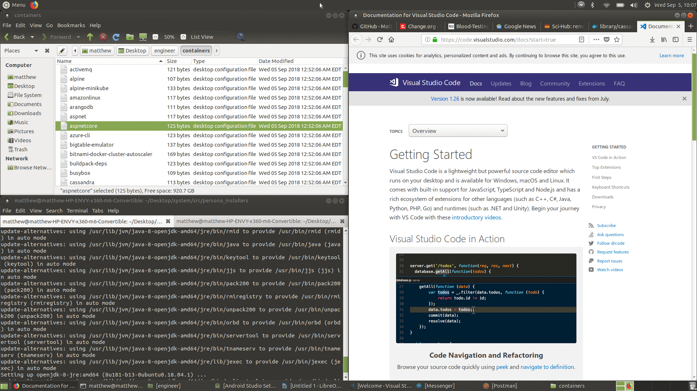

### _System is a free, elegant, and safe desktop framework designed for many types of computer users around the world._



System (version 1,[Antikythera](https://en.wikipedia.org/wiki/Antikythera_mechanism))  is a _desktop framework_ that equips various kinds of computer users with exceptional software and curated resources.

## General Persona
...todo...

## Engineer Persona
...todo...

## Creative Persona
...todo...

## Gamer Persona
...todo...

## Clinician Persona
...todo...

# Technical

## Installation

1. Install a modern Ubuntu v18-based operating system that has both `apt` and `snap` package managers.
2. Install the framework by running the following in your terminal (TODO: put in script):

```
cd ~/Desktop
# TODO: use Github release binary after soon time
wget https://github.com/GoTeamEpsilon/System/archive/master.zip
unzip master
mv System-master System
rm master
cd System/src
# cd ~/Desktop/System/src
cd persona_installers
./general.sh
```

3. Consider which personas you'd like to install and run the installers like so:

```
# cd ~/Desktop/System/src
cd persona_installers

./creative.sh

./clinician.sh

./engineer.sh

./gamer.sh
```


## Issues

See issue tracker for project statuses and to discuss System 💖.


## Devs

[Team Epsilon](https://github.com/GoTeamEpsilon/purpose) is a volunteer team of like-minded developers who strive to positively contribute to open source through code, education, and kindness. [Join us](https://github.com/GoTeamEpsilon/purpose/issues/new). Support us on [Patreon](https://www.patreon.com/matthewvi).


## License

Public Domain (CC0)
